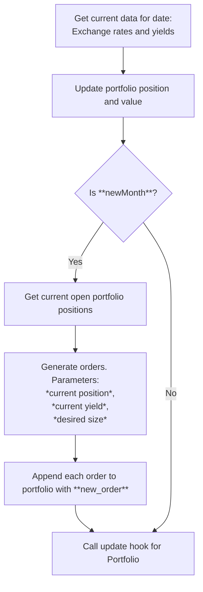

# FINS3666 Assignment 03

This repository contains the the code used to model, test and implement the elected trading strategy for team [TOTO](https://www.youtube.com/watch?v=FTQbiNvZqaY) in the FINS3666 Group Assessment.

## 📂 File Hierarchy

```
/FINS3666/Assignment03/
├── README.md                   # Project documentation
├── data/                       # Contains datasets used for analysis
│   ├── processed/              # Contains generated and cleaned datasets
│   └── raw/                    # Contains input .csv files
├── out/                        # Diagrams generated by the program
├── src/                        # Diagrams generated by the program
│   ├── setup.py                # Install script for fins3666 package
│   └── fins3666/               # Custom package containing implementations for many methods used
│       ├── setup.py            # Install script for fins3666 package
│       └── fins3666/           # Custom package containing implementations for most methods used
│           ├── defines/*       # Subpackage for defines, imports and config settings
│           ├── models/*        # Subpackage containing model implementation
│           ├── portfolio/*     # Implementation of portfolio class
│           ├── utils/*         # Subpackage containing general helper functions
│           └── __init__.py     # Package metadata
├── readme/*                    # Resources for readme
└── README.md                   # This very document!
```

## 🥅 Project Objective

The goal of this project is to perform financial analysis and modeling of a strategy of our choosing. This includes initial formulation, backtesting, out of sample testing, analysis and optimisation/refinement.

Generally, this code has the following objectives

- Data cleaning and preprocessing.
- Statistical or financial modeling.
- Generating insights and visualizations for use in the report.

## 📈 Strategy

As outlined in the report brief, the trading strategy implemented was that of a **_carry trade_** strategy. In simple terms, this entailed:

1. **Borrowing** (Shorting-Selling) units of currency at the lowest three corporate bond rates
2. **Buying** (Holding) risk-free securities in the three currencies with the highest interest rates
3. **Rebalancing** positions monthly to maintain a notional long and short position of **USD$12,000,000** (indexed to inflation).

## ⚙️ How It Works

The portfolio simulation was designed to be as robust as possible. As such, the implementation broadly relies on two key instances:

1. The `Portfolio` object, which handles internal calculations, indexing, asset values and orders.
2. The `models/carry_trade.py` script, which - given a list of current positions - determines the required orders to align the current portfolio with the strategy set out above.

In this way, the Portfolio can be composed of any number of assets - representing either a live position or a historical model. The portfolio asset data can be updated by feeding current asset data values and calling the `.update(datetime)` function - this will automatically index the current assets over the period specified.

### 1. Defining the Portfolio

Details of the `Portfolio` class implementation can be found below. In practice, defining a new portfolio requires only three parameters:

| Name        | Type             | Description                                                                                       |
| ----------- | ---------------- | ------------------------------------------------------------------------------------------------- |
| `timestamp` | `datetime64[ns]` | Instantiation time                                                                                |
| `balance`   | `List[Dict]`     | List of starting assets, with key-value pairs of `asset`, `units` and `unit_value` (**Optional**) |
| `fx_data`   | `List[Dict]`     | `List[Dict]` containing key-value pairs of fx rates for held assets at `timestamp` (**Optional**) |

#### Example

```python
startTime = datetime(2024,6,28)
startingAssets =
    [{
        'asset': 'USD',
        'units': 50_000,
        'unit_value_USD': 1.0},
        {
        'asset': 'NOK',
        'units': 10_000,
        'unit_value_USD': 0.094
    }]
currentData =
    [{
        'timestamp': startTime,
        'asset': "NOK",
        'tic': "USD/NOK",
        'bid': 10.6446,
        'ask': 10.6504,
        'mid': 10.6475,
    }]

SamplePortfolio = Portfolio(startTime, startingAssets, currentData)
```

Now, calling `print()` on the `Portfolio` object will output the following.

```python
print(SamplePortfolio)
```

#### Output

```
                                         Portfolio Overview
====================================================================================================
Asset    Value      Units          Total Value (USD)           Position       Yield p.a      Weight
====================================================================================================
USD      $1.00        50,000     $         50,000.00             Long           0.00%       98.16%
NOK      $0.09        10,000     $            939.19             Long           0.00%        1.84%

Portfolio - 2 assets
Timestamp: 2024-06-28 00:00:00,
Net Value ($USD): $50,939.19
```

### 2. Implementing the strategy

Having a portfolio with assets is well and good, but how do we modify or change our existing position? The answer is - as with actual portfolios - **_submitting orders_**. This can be achieved with the `Portfolio.new_order(Order)` function. This function takes an `Order` object (defined in `fins3666/deinfes.py`) - an immutable dataclass type with the following properties.

#### `Order` class

| Field        | Type                | Default        | Description                                    |
| ------------ | ------------------- | -------------- | ---------------------------------------------- |
| `asset`      | `str`               | _Required_     | The identifier or symbol of the asset.         |
| `units`      | `Union[int, float]` | _Required_     | The number of units to trade.                  |
| `order`      | `str`               | _Required_     | Action type (e.g., "buy", "sell").             |
| `timestamp`  | `datetime`          | _Required_     | Time the order was placed.                     |
| `currency`   | `Optional[str]`     | `'USD'`        | The currency used for settlement.              |
| `order_type` | `Optional[str]`     | `'market'`     | Type of order (e.g., "market", "limit").       |
| `expiry`     | `Optional[str]`     | `None`         | When the order expires (if applicable).        |
| `limit`      | `Optional[float]`   | `np.nan`       | Limit price, if a limit order.                 |
| `exchange`   | `Optional[str]`     | `None`         | Exchange where the order is to be placed.      |
| `asset_type` | `Optional[str]`     | `'Currency'`   | The type of asset (e.g., "Stock", "Currency"). |
| `order_id`   | `str`               | Auto-generated | Unique identifier for the order.               |

Defining an order is a straightforward affair.

```python
order_example = Order(
    asset="NOK/USD",
    units=100_000,
    order="buy",
    timestamp=datetime(2024,6,28),
    order_type="limit",
    expiry="2025-06-01T12:00:00",
    limit=0.09391,
    exchange="NYSE"
)
```

This will generate a **buy** order of 100,000 units of **NOK** with a limit price of **0.09391USD** per unit.

To see the full details of an order, call `print()`. Alternatively, to see a shorter version, use `Order.summary_str()`.

```python
print(order_example)
print('\n')
print(order_example.summary_str())
```

**Outputs:**

```
Order ID: f0661a90-28f7-11f0-b460-00155dd4b9c5 | Asset: NOK/USD | Units: 100000 | Order Type: limit | Order Side: buy | Timestamp: 2024-06-28T00:00:00 | Currency: USD | Limit Price: 0.09391 | Expiry: 2025-06-01T12:00:00 | Exchange: NYSE | Asset Type: Currency


BUY 100000 NOK/USD @ 0.09391 (ID: f0661a90)
```

#### Queueing an Order

To add an order to your portfolio, call `Portfolio.add_order(Order)`. This will add an order to the queue. Orders will be automatically executed if the limit price is hit, or immediately if the `order_type` field is set to `'market'`, as the orders are checked each time the `Portfolio.update()` function is called.

#### `carry_trade.py`

This function generates a list of `Order` objects, based on the existing portfolio position and current borrow and invest rates. It dynamically generates a list of sell orders with direct currency conversion between each - **no double crossing of the spread!**

In addition to this, the `size` parameter can be set, which indicates the desired notional value of the long and short positions. This allows the function to handle rebalancing faster-growing positions at the same time as divesting or investing in a new currency.

### Strategy Execution

With these building blocks in place, the backtesting/execution engine can be broken down into the following loop:
<br>



</br>

#### Sample Loop

```python
fx_data = pd.read_csv('sampleFX.csv')
'''
    a dataframe with the columns ['timestamp'], ['tic'], ['bid'], ['ask'] and ['mid']. Example:
    >>>     timestamp               tic          bid        ask         mid
    >>> 0   2024-06-28 00:00:00	    USD/NOK	    10.6446	    10.6504	    10.6475
    >>> 1   2024-06-28 00:00:00	    USD/JPY	    160.84	    160.88	    160.86
    >>> 2	2024-06-28 00:00:00	    USD/NZD	    1.6404199	1.6417665	1.641093
    >>> 3	2024-06-28 00:00:00	    USD/CAD	    1.3682	    1.3685	    1.36835
    >>> 4	2024-06-28 00:00:00	    USD/GBP	    0.7909515	0.7912018	0.79107666
    >>> 5	2024-06-28 00:00:00	    USD/SEK	    10.5875	    10.5929	    10.5902
    >>> 6	2024-06-28 00:00:00	    USD/EUR	    0.9329229	0.9331840	0.93305343
    >>> 7	2024-06-28 00:00:00	    USD/CHF	    0.8984	    0.8988	    0.8986
    >>> 8	2024-06-28 00:00:00	    USD/AUD	    1.4970060	1.4976786	1.4973422
'''
mkt_data = pd.read_csv('sampleYields.csv')
'''
    a dataframe with the columns ['Timestamp'], and [f'{Asset} SHORT'] and [f'{Asset} LONG'] columns, for each held asset.
    Yields are expressed in percentage points, per annum. Example:
    >>>  Timestamp              GBP SHORT	GBP LONG	USD SHORT	USD LONG	JPY SHORT	JPY LONG
    >>>  2024-06-22 00:00:00    6.764	    5.321   	7.157	    5.991	    1.641   	1.749
    >>>  2024-06-23 00:00:00    6.757	    5.321   	7.141	    5.991	    1.646   	1.749
    >>>  2024-06-24 00:00:00    6.764	    5.321   	7.147	    5.991	    1.638   	1.749
    >>>  2024-06-25 00:00:00    6.755	    5.321   	7.165	    5.991	    1.629   	1.749
    >>>  2024-06-26 00:00:00    6.762	    5.321   	7.227	    5.991	    1.651   	1.749
    >>>  2024-06-27 00:00:00    6.757	    5.321   	7.239	    5.991	    1.650    	1.749
    >>>  2024-06-28 00:00:00    6.759	    5.321   	7.234	    5.991	    1.646   	1.749
'''

startTime = timestamp(2010,1,1)
endTime = timestamp(2020,1,1)

currentDate = startTime
while currentDate < endTime:
    # Filter datasets to contain up-to and including today
    fx_current = fx_data[fx_data['timestamp'] <= currentDate]
    yield_current = fx_data[fx_data['timestamp'] <= currentDate]

    # Feed filtered sets to Portfolio
    portfolio.updateMarketData(currentData=fx_data, yields=yields)

    # Call update function to index value of held positions
    portfolio.update(date)

    # increment date
    currentDate += timedelta(days=1)
```

## ❓Implementation Details - `Portfolio` Class

The `Portfolio` class represents a snapshot of a financial asset portfolio. It provides a structured view of a collection of assets, each with associated properties such as size, unit value, weight, and position. The class automatically calculates derived metrics like individual asset values and portfolio weights, and offers space for later population of performance metrics like Sharpe ratio or drawdown.

---

### ✅ Purpose

Use the `Portfolio` class to:

- Represent a collection of assets in a structured form
- Compute asset values and portfolio weights automatically
- Store key portfolio-level metrics for later analysis
- Export or inspect the portfolio as a pandas `DataFrame`

---

### 📦 Constructor

```python
Portfolio(assets, sizes=None, positions=None, unit_values=None, timestamp=None)
```

#### Parameters

| Name          | Type                        | Description                                                                  |
| ------------- | --------------------------- | ---------------------------------------------------------------------------- |
| `assets`      | `list`                      | List of asset identifiers (e.g., `["USD", "GBP", "ASX.CBA"]`) (**required**) |
| `sizes`       | `list` or `array`, optional | Quantity of each asset held. Defaults to 0 for each asset.                   |
| `positions`   | `list` or `array`, optional | Position metadata per asset. Defaults to 0 for each asset.                   |
| `unit_values` | `list` or `array`, optional | Notional value of a single unit of each asset. Defaults to 0.                |
| `timestamp`   | `any`, optional             | Timestamp to indicate the valuation date/time of the portfolio.              |

---

### 📊 Public Methods

#### `summary()`

```python
summary() -> pd.DataFrame
```

Returns a pandas `DataFrame` representing the current state of the portfolio.

| Column       | Description                                                       |
| ------------ | ----------------------------------------------------------------- |
| `Size`       | Quantity of the asset held                                        |
| `UnitValue`  | Value of a single unit of the asset                               |
| `AssetValue` | Total value = Size × UnitValue                                    |
| `Position`   | Additional user-defined metric or metadata                        |
| `Weight`     | Proportion of the asset’s value relative to total portfolio value |

---

### 🔢 Public Attributes

| Attribute       | Type           | Description                           |
| --------------- | -------------- | ------------------------------------- |
| `assets`        | `list`         | Asset identifiers                     |
| `sizes`         | `np.ndarray`   | Asset quantities                      |
| `positions`     | `np.ndarray`   | Position values                       |
| `unit_values`   | `np.ndarray`   | Value per unit                        |
| `asset_values`  | `float`        | Total value of all assets combined    |
| `total_value`   | `float`        | Sum of all asset values               |
| `weights`       | `np.ndarray`   | Weight of each asset in the portfolio |
| `timestamp`     | `any`          | Portfolio timestamp                   |
| `sharpe_ratio`  | `float64`      | Sharpe ratio (to be calculated)       |
| `sortino_ratio` | `float64`      | Sortino ratio                         |
| `max_drawdown`  | `float64`      | Max Drawdown                          |
| `volatility`    | `float64`      | Portfolio Volatility                  |
| `beta`          | `float64`      | Beta                                  |
| `alpha`         | `float64`      | Alpha                                 |
| `data`          | `pd.DataFrame` | Underlying portfolio DataFrame        |

---

### 🧾 Representation

```python
repr(portfolio)
```

Returns the portfolio's `DataFrame` as a string, along with a summary line:

```
USD     100     1.00    100.0   0.0     0.25
EUR     200     2.00    400.0   0.0     0.75
Portfolio - (2 assets)
```

## ❓Implementation Details - `carry_trade.py`

The

## ⚠️ Requirements

- Python 3.x
- Required libraries (e.g., pandas, numpy, matplotlib, etc.)

Install dependencies using:

```bash
pip install -r requirements.txt
```

## 📓 Notes

<details markdown="1">
<summary><b>Don't click!! </b>😟</summary>

If anyone has actually bothered to read this far, just know that I love you. 💞


You may also feel free to question why on earth I went to all the effort of writing this documentation. I would implore you to keep asking because I don't have the answer. Just wanted a break from coding I guess.

<p align="center"><b>
TG
</p> </b>
</details>
